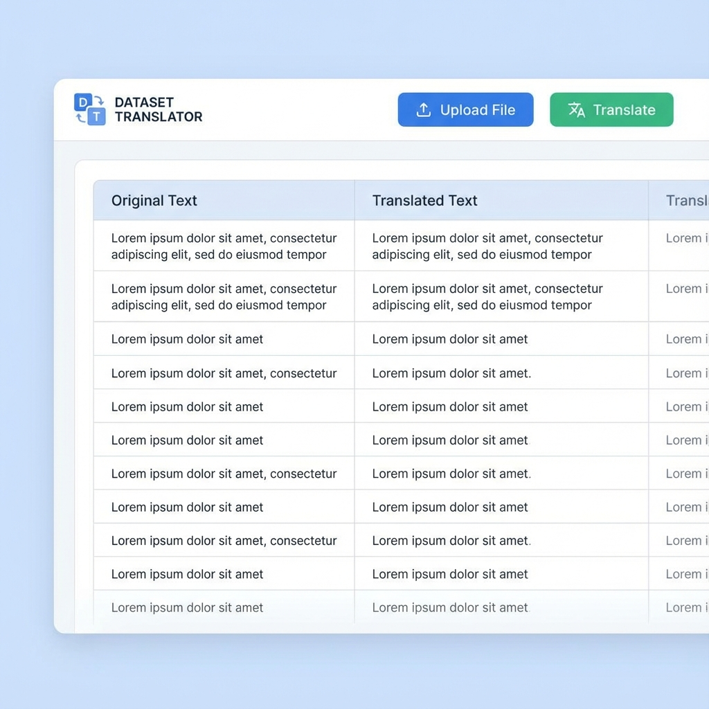
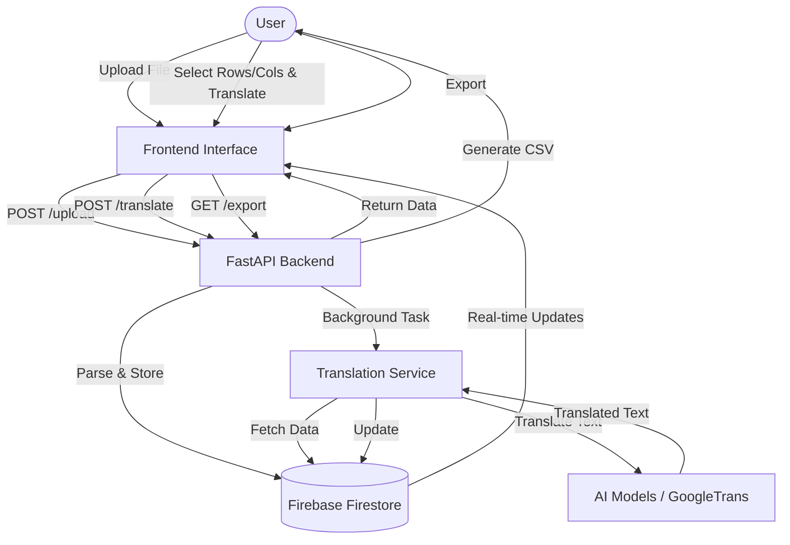

# Dataset Translator



## Giới thiệu
Dataset Translator là một công cụ mạnh mẽ giúp dịch các bộ dữ liệu lớn (CSV, Excel, JSON, TXT) một cách tự động và chính xác sử dụng công nghệ AI. Dữ liệu được hiển thị trực quan dưới dạng bảng, cho phép người dùng dễ dàng theo dõi và chỉnh sửa.

## Lưu đồ hoạt động



## Công nghệ sử dụng

### Frontend
- **React**: Thư viện UI chính.
- **Vite**: Build tool nhanh chóng.
- **TailwindCSS**: Styling framework.

### Backend
- **FastAPI**: Framework Python hiệu năng cao.
- **Python**: Ngôn ngữ xử lý chính.
- **Pandas**: Xử lý dữ liệu dạng bảng.

### Cơ sở dữ liệu & Services
- **Firebase Firestore**: Lưu trữ dữ liệu thời gian thực.
- **AI Models**: Sử dụng `transformers`, `llama-cpp` và `googletrans` cho việc dịch thuật.

## Cài đặt và Chạy

### Backend
```bash
cd backend
pip install -r requirements.txt
python main.py
```

### Frontend
```bash
cd frontend
npm install
npm run dev
```
